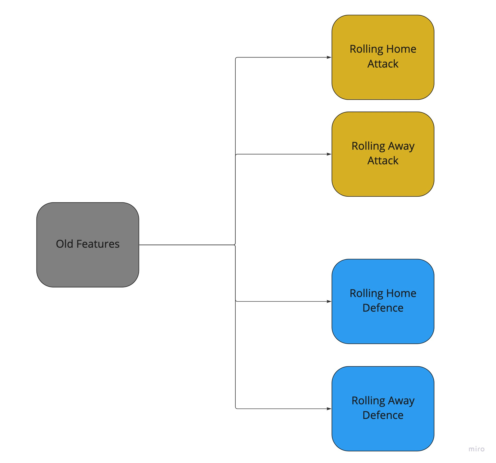

# Premier League Predictions :england:

### Data
Features:
Premier league matche details from 2000 to 2017 season. Featurs are different perfomance metrices and general match evaluation attributes.
<!--  -->

| Feature | Feature Abbreviation     | 
| :-------- | :------- | 
|Season  | year of season  | 
| Datetime |datetome details  | 
| HomeTeam |  home team name| 
|  AwayTeam| away team name | 
| FTHG | full time home goals | 
| FTAG |  full time away goals| 
| HTHG |  half tome home goals| 
|  HTAG| half time away goals | 
| FTR | full time results | 
|  HTR|  half time results| 
|  Referee| referee name | 
| HS | home shots | 
| AS |  away shots| 
| HST |  home shots on target| 
|  AST|  away shots on target| 
|  HC|  home corners| 
|  AC| away corners | 
|  HF| home fouls | 
|  AF|  away fouls| 
| HY |  home yellow | 
| AY | away yellow | 
| HR |  home red| 
| AR | away red | 

### Design

### Feature Engineering
many of the features are potential data leakage factors since most of them are happening in the match so the approach is to change the features into  rolling features. so every time we look at a match we would see their current profile/form delivered through the attibutes

#### Attack 

#### Defence 

### Algorithm

