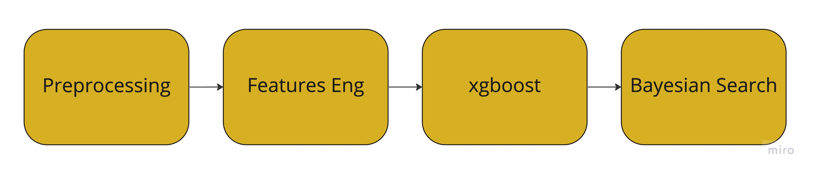

# Premier League Predictions :england:

### Data
Features:
Premier league matche details from 2000 to 2017 season. Featurs are different perfomance metrices and general match evaluation attributes.
<!--  -->

| Feature | Feature Abbreviation     | 
| :-------- | :------- | 
|Season  | year of season  | 
| Datetime |datetime details  | 
| HomeTeam |  home team name| 
|  AwayTeam| away team name | 
| FTHG | full time home goals | 
| FTAG |  full time away goals| 
| HTHG |  half time home goals| 
|  HTAG| half time away goals | 
| FTR | full time results | 
|  HTR|  half time results| 
|  Referee|  name of referee | 
| HS | home team shots | 
| AS |  away team shots| 
| HST |  home team shots on target| 
|  AST|  away team shots on target| 
|  HC|  home team corners| 
|  AC| away team corners | 
|  HF| home team fouls | 
|  AF|  away team fouls| 
| HY |  home team yellow cards| 
| AY | away team yellow cards| 
| HR |  home team red cards| 
| AR | away team red cards| 

### Design

### Feature Engineering
many of the features are potential data leakage factors, since most of them are recorder in the match. so, the approach is to change the features into  rolling features. so every time we look at a match we would see their current profile/form delivered through the attibutes recorded through the last 'n' matches n taken as a costomizable number.
what am i really trying to get from the data is every time a match happens between a home team and away team we need to get 2 sets of features for both the teams
- Home attck features - rolling attcking features of last n matches
- Home defeance features - rolling, oppositions attacking features in last n matches
- Away attack features - rolling attcking features of last n matches
- Away defence feature - solling, oppositions attacking features in last n matches

All of them as the rolling avarages, of last n matches they played. and before every match we have a statistical match-up between these features.

### Ealaborate Pipeline

